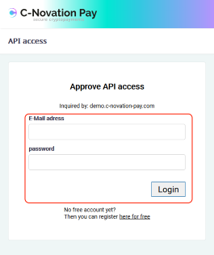
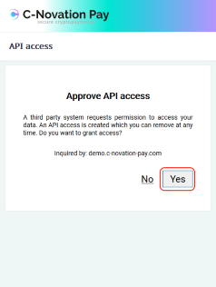
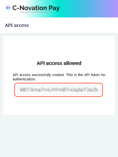

Getting a Token in the Portal
=============================
You can manage all your API Token in your portal account:    
[https://www.c-novation-pay.com/portal/apitoken/](https://www.c-novation-pay.com/portal/apitoken/)     
It will allow you to create new tokens, see payments created with tokens and even delete tokens.

Getting a Token using the API UI
================================
The API provides a simple UI to create an API Token. Simply point the browser to    
[https://www.c-novation-pay.com/api/authenticate](https://www.c-novation-pay.com/api/authenticate)    
and it will guide you through the process.

    
    
    
    
Copy that token and use it in your system.    
The new token will appear in your portal account too and can be managed there.