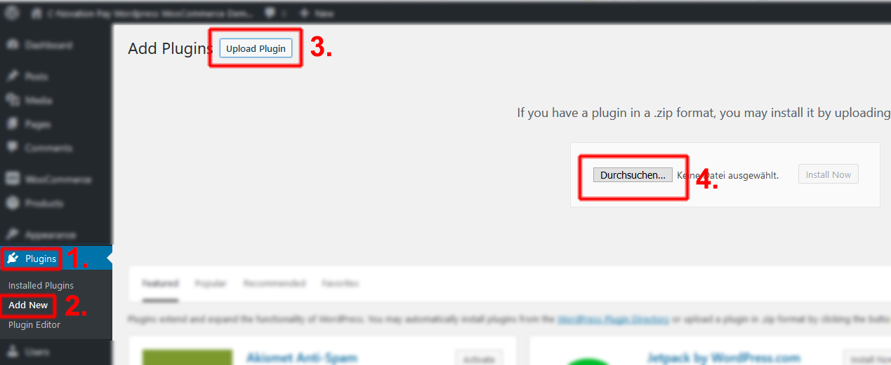
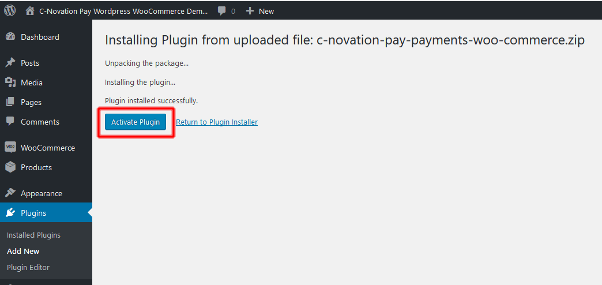
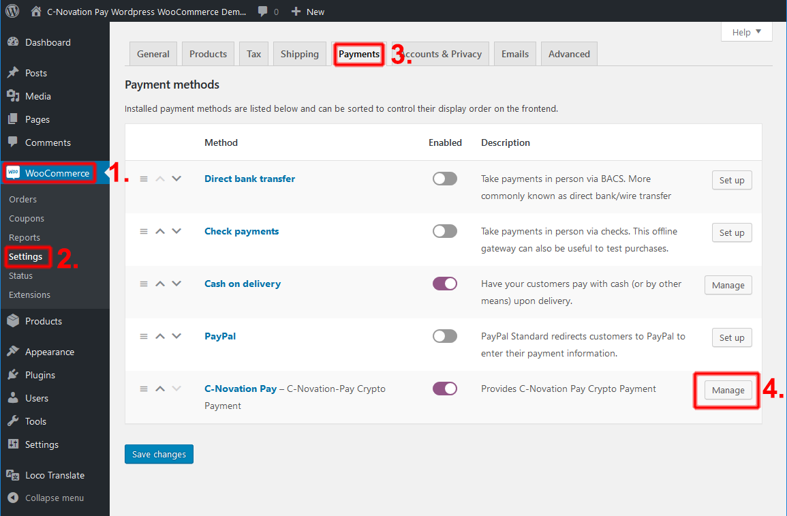
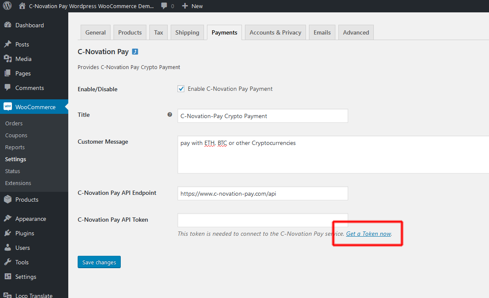
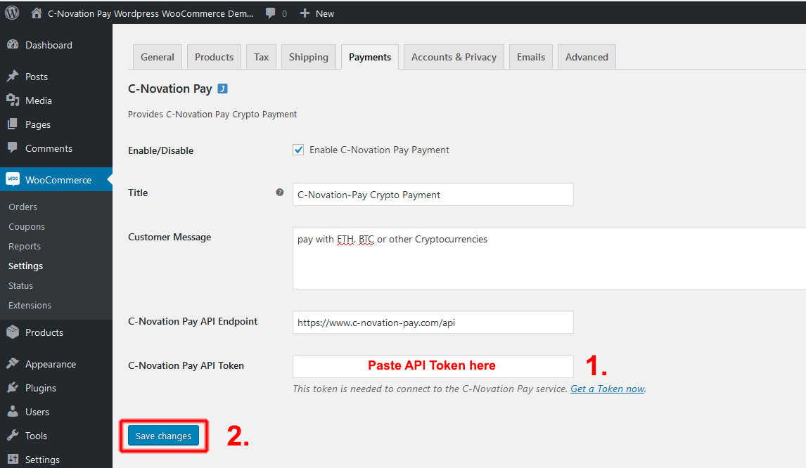

# Installation

Installing the plugin follows the standard procedure.
This is namely:
* upload the plugin ZIP file    
* install it    
* configure it    
* use it  

## upload

## install it

## configure it

Once the plugin is uploaded and installed, you need to get an API token to
connect it to the CNovation-Pay ecosystem. You may generate a new token in your portal account
or you can simply click on the "get a access now" Link on the plugin config screen:

An new windows opens and leads you to the process of [generating an API Token](../docs/get_token.md).

Copy that token, paste it into the plugin config window and save:

# Remarks
The WooCommerce plugin follows the "default-UI" principle. It uses the
PHP-CNovationPayClient to start an checkout process and then awaits for the user to return.
